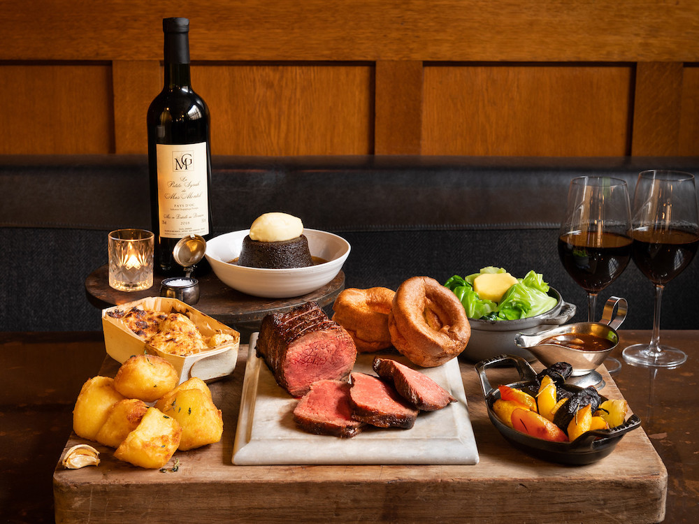
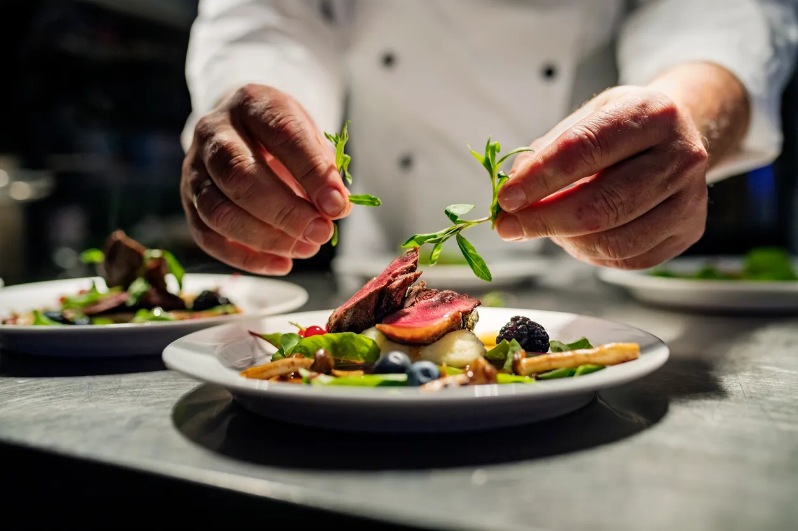

<!DOCTYPE html>
<html lang="en">
<head>
    <meta charset="UTF-8">
    <meta name="viewport" content="width=device-width, initial-scale=1.0">
    <title>Our Vision - The Dublin Plate</title>
    <link href="https://cdnjs.cloudflare.com/ajax/libs/bootstrap/5.3.0/css/bootstrap.min.css" rel="stylesheet">
    <link href="https://cdnjs.cloudflare.com/ajax/libs/font-awesome/6.4.0/css/all.min.css" rel="stylesheet">
    <link rel="stylesheet" href="styles.css">
</head>
<body>
    <!-- Restaurant Name Header -->
    <h1 class="main-title">The Dublin Plate</h1>
    
    <!-- Navigation -->
    <nav class="navbar navbar-expand-lg navbar-light bg-white">
        

            <button class="navbar-toggler" type="button" data-bs-toggle="collapse" data-bs-target="#navbarNav" aria-controls="navbarNav" aria-expanded="false" aria-label="Toggle navigation">
                
            </button>
            

                <ul class="navbar-nav">
                    <li class="nav-item">
                        <a class="nav-link" href="menu.html">Home</a>
                    </li>
                    <li class="nav-item">
                        <a class="nav-link active" href="vision.html">Our Vision</a>
                    </li>
                    <li class="nav-item">
                        <a class="nav-link" href="menu.html">Menu</a>
                    </li>
                    <li class="nav-item">
                        <a class="nav-link" href="#">Order Online</a>
                    </li>
                    <li class="nav-item">
                        <a class="nav-link" href="#">Blog</a>
                    </li>
                    <li class="nav-item">
                        <a class="nav-link" href="#">Contact Us</a>
                    </li>
                </ul>
            

        

    </nav>

    <!-- Vision Content -->
    

        

            

                

                    <h2 class="mb-4">Our Vision</h2>
                    

                        At The Dublin Plate, we believe that great food is more than just sustenance—it's an experience that brings people together. Our vision is to create a warm, welcoming space where tradition meets innovation, offering a taste of Ireland's rich culinary heritage with a modern twist. We strive to be more than just a restaurant; we aim to be a gathering place where every meal tells a story, every dish is crafted with care, and every guest feels like family.
                    

                

            

            

                
            

        

        

            

                

                    <h2 class="mb-4">Our Philosophy</h2>
                    

                        Steeped in the flavors of Ireland, The Dublin Plate celebrates time-honored recipes while embracing contemporary techniques and global influences. From hearty Irish stews to reimagined classics, our menu is a tribute to the past and a nod to the future. We source the finest local ingredients, supporting Irish farmers and producers, to ensure every bite is fresh, flavorful, and sustainable.
                    

                

            

            

                
            

        

        

            

                

                    <h2 class="mb-4">The Experience</h2>
                    

                        The Dublin Plate is where food, tradition, and community come together. Enjoy casual lunches, celebratory dinners, or cozy evenings by the fire in our rustic-modern space, complete with weekend live music and a bar featuring premium Irish whiskeys and craft beers. We pride ourselves on exceptional service, a welcoming atmosphere, and dishes crafted with care. Our passionate team ensures every visit is memorable, staying true to our values of authenticity, generosity, and a love for great food.
                    

                

            

            

                
            

        

        

            
Join us at The Dublin Plate, where every meal is a celebration of Irish culture, community, and culinary artistry.

        

    

    
    
</body>
</html>
